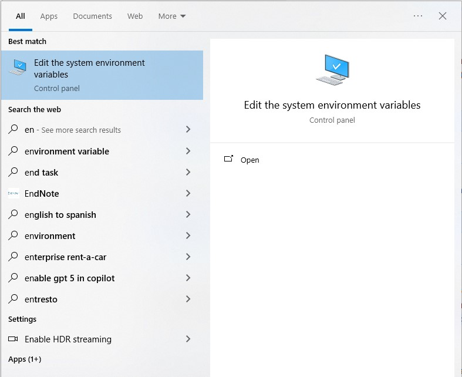
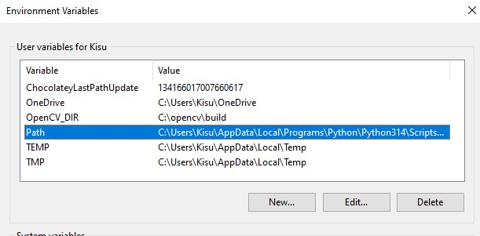

# Valorant-Vision

# FOR LINUX (Debian/Ubuntu)

## Requirements
- An editor such as VSCodium
- CMake (Source Distribution)

  `https://cmake.org/download/`
- OpenCV

  `sudo apt update`

  `sudo apt install build-essential cmake libopencv-dev`
- QT

  `sudo apt install qt6-base-dev qt6-declarative-dev qt6-multimedia-dev libqt6multimediawidgets6`

## Running Software

- Make sure you are in the Valorant Vision Folder Directory
  
1. `cmake ..`

2. `make -j$(nproc)`

3. `./Valorant-Vision`
  
  

---
# FOR WINDOWS

## Requirements

### Windows Build Requirements
- Visual Studio with **MSVC v142 (2019 build tools)** installed  
- Qt built with **MSVC 2022**  
  - Example installation path:  
    `C:\Qt\6.10.2\msvc2022_64`
- OpenCV installed  
  - Example path:  
    `C:\opencv\build\bin`
- Cmake Installed

## Environment Variables

## PATH Additions (User Variables)
Press Windows Key and search `edit environment variables for your account`

Select `Environment Varaibles` option below Startup and Recovery.

Add the following paths to the highlighted option in the image:

AFTER DOUBLE CLICKING ON Path!!  
`C:\Qt\6.10.2\msvc2022_64\bin`  
`C:\opencv\build\bin`

## To make the Build
After changing to the directory the code run these commands in the following order:  
`cmake -S . -B build -G "Visual Studio 17 2022" -A x64 -T v142` - Forces Cmake to use v142 toolset  
`cmake --build build --config Release` - makes a release build in the following directory: build/Release/Valorant-Vision.exe  
  
If you need to rebuild or make the build again run the following code before to delete the previous build:  
`rmdir /s /q build`

# For MacOS

## Requirements

